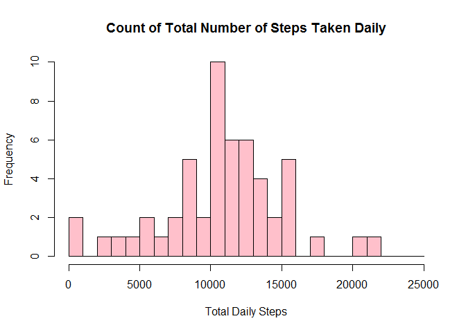
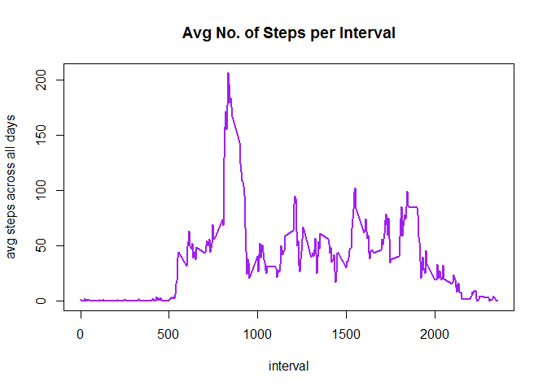
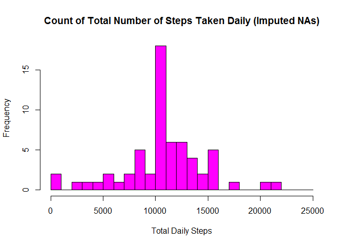

_________


##Introduction

This document explores data obtained from a personal activity monitoring device. The device collects data at 5 minute intervals through out the day. The dataset would consist of two months of data from an anonymous individual collected during the months of October and November, 2012 and include the number of steps taken in 5 minute intervals each day.

####This document contains the following:

- Code for reading in the dataset and/or processing the data
- Histogram of the total number of steps taken each day
- Mean and median number of steps taken each day
- Time series plot of the average number of steps taken
- The 5-minute interval that, on average, contains the maximum number of steps
- Code to describe and show a strategy for imputing missing data
- Histogram of the total number of steps taken each day after missing values are imputed
- Panel plot comparing the average number of steps taken per 5-minute interval across weekdays and weekends
- All of the R code needed to reproduce the results (numbers, plots, etc.) in the report

##Modifying global settings

Before starting with the code, global settings is modified to turn off warnings and set echo = TRUE.


```r
knitr::opts_chunk$set(warning=FALSE, echo = TRUE, message = FALSE)
```

## Loading and preprocessing the data


```r
library(lattice)
library(dplyr)

dataset <- read.csv(unzip("activity.zip"))

dataset$date <- as.POSIXct(dataset$date, "%Y-%m-%d")
dataset <- mutate(dataset, dayname = weekdays(dataset$date))

str(dataset)
```

```
## 'data.frame':	17568 obs. of  4 variables:
##  $ steps   : int  NA NA NA NA NA NA NA NA NA NA ...
##  $ date    : POSIXct, format: "2012-10-01" "2012-10-01" ...
##  $ interval: int  0 5 10 15 20 25 30 35 40 45 ...
##  $ dayname : chr  "Monday" "Monday" "Monday" "Monday" ...
```

## What is mean total number of steps taken per day?

Calculating the total number of steps taken per day:


```r
DaySteps <- dataset %>%
              group_by(date) %>%
              summarise(steps = sum(steps))
```

Making a histogram of the total number of steps taken per day:


```r
hist(DaySteps$steps, main = "Count of Total Number of Steps Taken Daily", 
    ylab = "Frequency", xlab = "Total Daily Steps", col = "pink", 
    breaks = seq(0, 25000, by=1000))
```

<!-- -->

Calculating the mean and median of the total number of steps taker per day:


```r
mean(DaySteps$steps, na.rm = TRUE)
```

```
## [1] 10766.19
```

```r
median(DaySteps$steps, na.rm = TRUE)
```

```
## [1] 10765
```

The mean is **10766.19**, while the median is **10765**.

## What is the average daily activity pattern?

Making a time series plot of the 5-minute interval (x-axis) and the average number of steps taken, averaged across all days (y-axis):


```r
IntervalSteps <- dataset %>%
              group_by(interval) %>%
              summarise(avgsteps = mean(steps, na.rm = TRUE))

plot(x = IntervalSteps$interval, y = IntervalSteps$avgsteps,
     type = "l", col = "purple", lwd = 2,
     main = "Avg No. of Steps per Interval", xlab = "interval", 
     ylab = "avg steps across all days")
```

<!-- -->

Calculating which 5-minute interval, on average across all the days in the dataset, contains the maximum number of steps:


```r
IntervalSteps[which.max(IntervalSteps$avgsteps), 1]
```

```
## # A tibble: 1 x 1
##   interval
##      <int>
## 1      835
```

The interval is **835**.

## Imputing missing values

Note that there are a number of days/intervals where there are missing values (coded as NA). The presence of missing days may introduce bias into some calculations or summaries of the data.

Calculating the total number of missing values in the dataset (i.e. the total number of rows with NAs)


```r
sum(is.na(dataset))
```

```
## [1] 2304
```

The total rows with NA are **2304**.

Filling in all of the missing values in the dataset. The strategy to be used is the mean for that 5-minute interval. Data will come from the previous variable created, *IntervalSteps*.

Creating a new dataset that is equal to the original dataset but with the missing data filled in.


```r
NewDataset <- merge(dataset, IntervalSteps, by = "interval")

NewDataset <- mutate(NewDataset, 
                     steps = if_else(is.na(steps), avgsteps, as.double(steps)))
NewDataset <- select(NewDataset, steps, date, interval, dayname)
```

Making a histogram of the total number of steps taken each day. 


```r
NewDaySteps <- NewDataset %>%
              group_by(date) %>%
              summarise(steps = sum(steps))

hist(NewDaySteps$steps, main = "Count of Total Number of Steps Taken Daily (Imputed NAs)", 
    ylab = "Frequency", xlab = "Total Daily Steps", col = "magenta", 
    breaks = seq(0, 25000, by=1000))
```

<!-- -->

Calculating and reporting the mean and median total number of steps taken per day.


```r
mean(NewDaySteps$steps)
```

```
## [1] 10766.19
```

```r
median(NewDaySteps$steps)
```

```
## [1] 10766.19
```

Mean and Median are now both equal to **10766.19**.

*Do these values differ from the estimates from the first part of the assignment? What is the impact of imputing missing data on the estimates of the total daily number of steps?*

Yes, the values are now different after imputing missing values. We now have more frequency since NA observations have been filled up, and median increases a bit and is now equal to the mean.

## Are there differences in activity patterns between weekdays and weekends?

Creating a new factor variable in the dataset with two levels - "weekday" and "weekend" indicating whether a given date is a weekday or weekend day.


```r
NewDataset <- mutate(NewDataset, 
                     daytype = if_else(dayname == "Saturday" | 
                                          dayname == "Sunday", "weekend", "weekday"))
```

Making a panel plot containing a time series plot of the 5-minute interval (x-axis) and the average number of steps taken, averaged across all weekday days or weekend days (y-axis).


```r
NewIntervalSteps <- NewDataset %>%
              group_by(interval, daytype) %>%
              summarise(avgsteps = mean(steps, na.rm = TRUE))

xyplot(avgsteps ~ interval | factor (daytype), data = NewIntervalSteps, type = "l",
       xlab = "Interval", ylab = "Number of Steps", layout = c(1,2))
```

<!-- -->
